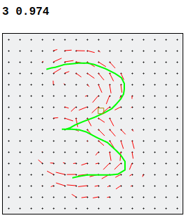
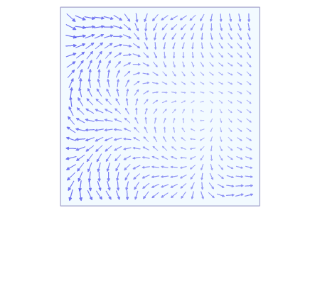

# gesture-recognition

Handwriting and gesture recognition with line integrals. 

## How it Works

[Line integrals][1] compute how closely
a path agrees with a directional field.
For example, one could compute the force
of a swimmer swimming across a current
in water.

(Animation from Wikipedia)

A directional field is drawn for each glyph.
The line integral is computed between the inputted gesture 
and each glyph field.
This technique works well for gesture input, but would not work for OCR,
as the direction of the strokes is the main feature
used for detection.

[1]: https://en.wikipedia.org/wiki/Line_integral

# Project License

Copyright (c) 2018 Justin Meiners

Permission to use, copy, modify, and distribute this software for any purpose with or without fee is hereby granted, provided that the above copyright notice and this permission notice appear in all copies.

THE SOFTWARE IS PROVIDED "AS IS" AND THE AUTHOR DISCLAIMS ALL WARRANTIES WITH REGARD TO THIS SOFTWARE INCLUDING ALL IMPLIED WARRANTIES OF MERCHANTABILITY AND FITNESS. IN NO EVENT SHALL THE AUTHOR BE LIABLE FOR ANY SPECIAL, DIRECT, INDIRECT, OR CONSEQUENTIAL DAMAGES OR ANY DAMAGES WHATSOEVER RESULTING FROM LOSS OF USE, DATA OR PROFITS, WHETHER IN AN ACTION OF CONTRACT, NEGLIGENCE OR OTHER TORTIOUS ACTION, ARISING OUT OF OR IN CONNECTION WITH THE USE OR PERFORMANCE OF THIS SOFTWARE.

